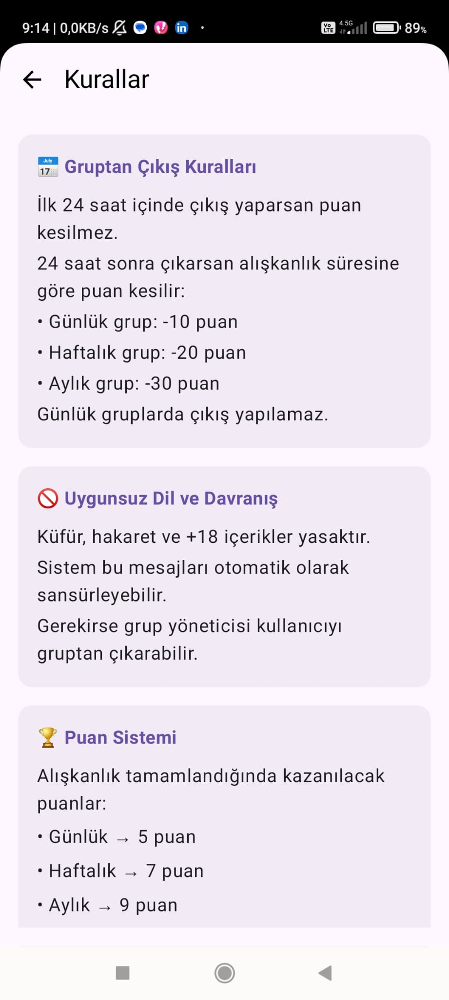
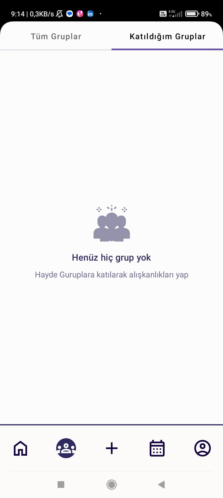
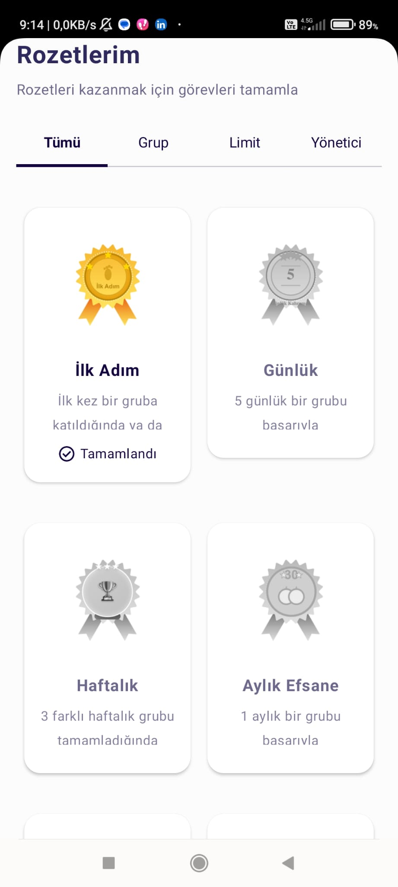
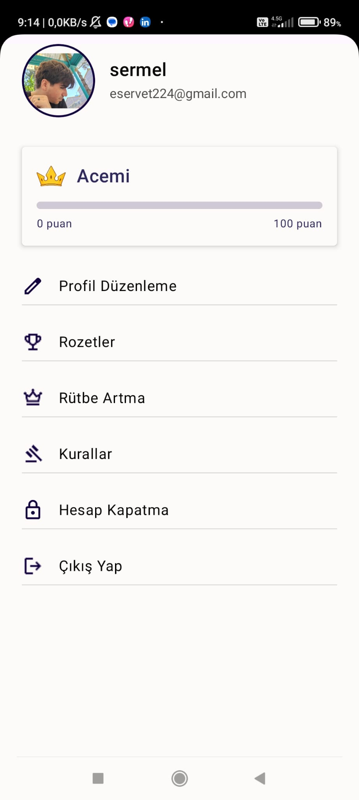
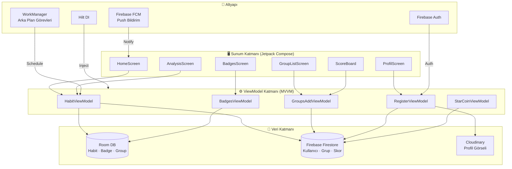

<div align="center">

# GoalMate

**Kişisel alışkanlık takip uygulamanız — takip edin, rekabet edin ve birlikte büyüyün.**

[](https://developer.android.com)
[](https://kotlinlang.org)
[](https://developer.android.com/jetpack/compose)
[](https://firebase.google.com)
[](https://developer.android.com/about/versions/nougat)
[](LICENSE)

</div>

---

## 📸 Ekran Görüntüleri

| Kurallar | Gruplar | Rozetler | Profil |
|:--------:|:-------:|:--------:|:------:|
|  |  |  |  |

---

## 🏛️ Mimari Diyagram




---


---

## � Hakkında

**GoalMate**, olumlu alışkanlıklar edinmenize ve sürdürmenize yardımcı olan modern bir Android alışkanlık takip uygulamasıdır. Kişisel gelişim, sağlık veya kariyer hedefleriniz olsun; GoalMate sizi rozetler, sıralama sistemi, grup challengeları ve gerçek zamanlı liderlik tablosuyla motive eder.

---

## ✨ Özellikler

### 🎯 Alışkanlık Takibi
- Özel ikon, renk, sıklık (günlük / haftalık / aylık) ve süre ile alışkanlık oluşturma
- Onay diyaloğuyla sola kaydırarak silme (Swipe-to-Delete)
- Günlük ilerleme çubuğu ve tamamlanma yüzdesi
- Tüm alışkanlıklar tamamlandığında Lottie kutlama animasyonu

### 📊 Analiz ve İstatistikler
- Animasyonlu ilerleme göstergesiyle alışkanlık detay ekranı
- Tamamlanma oranı, kalan süre ve zorluk rozeti
- İlerlemeye göre emoji tabanlı ruh hali geri bildirimi
- Tamamlanan ve tamamlanmayan gün dökümü

### 👥 Grup Challengeları
- Kategori filtreleriyle tüm açık/özel grupları görüntüleme (Sağlık, Finans, Kariyer, Teknoloji vb.)
- Üye limiti ve gizlilik ayarlarıyla grup oluşturma veya katılma
- Gerçek zamanlı grup içi sohbet
- Gruba özel alışkanlık takibi ve skor tablosu

### 🏆 Skor Tablosu
- Her grup için alışkanlık tamamlanma oranına göre canlı liderlik tablosu
- İlk 3 üye için Altın / Gümüş / Bronz sıralama göstergeleri
- Herhangi bir üyenin profiline tıklayarak görüntüleme

### 🥇 Rozetler ve Başarımlar
- Grup Tamamlama, Limit Artırma, Yönetici, Uygulama Kullanımı kategorilerinde 17+ benzersiz rozet
- Kazanılmamış rozetler gri gösterilir; kazanıldığında açılır pencere bildirimi
- Kategoriye göre filtrelenebilir rozet galerisi

### 👤 Profil ve Sıralama
- Cloudinary bulut depolama ile özelleştirilebilir avatar
- Puan tabanlı rütbe sistemi ve rütbe ikonları
- Diğer kullanıcıların genel profillerini görüntüleme

### 🔔 Push Bildirimleri
- Firebase Cloud Messaging (FCM) entegrasyonu
- Alışkanlık hatırlatıcıları için zamanlanmış tam alarmlar
- Ayarlar derin bağlantısıyla uygulama içi bildirim izin diyaloğu

---

## �️ Teknoloji Yığını

| Katman | Teknoloji |
|---|---|
| **Dil** | Kotlin |
| **UI** | Jetpack Compose + Material 3 |
| **Mimari** | MVVM + Clean Architecture |
| **DI** | Hilt (Dagger) |
| **Yerel Veritabanı** | Room |
| **Uzak Veritabanı** | Firebase Firestore |
| **Kimlik Doğrulama** | Firebase Authentication |
| **Push Bildirim** | Firebase Cloud Messaging (FCM) |
| **Görsel Depolama** | Cloudinary |
| **Görsel Yükleme** | Coil |
| **Animasyonlar** | Lottie Compose |
| **Grafikler** | compose-charts (ehsannarmani) |
| **Arka Plan İşleri** | WorkManager |
| **Asenkron** | Kotlin Coroutines + Flow |
| **Ağ** | Volley |
| **Serileştirme** | Gson |

---

## 📱 Ekranlar

| Ekran | Açıklama |
|---|---|
| **Karşılama / Giriş** | Onboarding ve Firebase Auth ile giriş |
| **Ana Ekran** | Günlük alışkanlık listesi, ilerleme özeti, motivasyon sözü |
| **Analiz** | Animasyonlu ilerleme ile alışkanlık istatistikleri |
| **Gruplar Listesi** | Tüm grupları görüntüleme ve filtreleme |
| **Grup Detayı** | Grup bilgisi, üyeler ve katılma/ayrılma işlemleri |
| **Grup Sohbeti** | Grup içi gerçek zamanlı mesajlaşma |
| **Skor Tablosu** | Grup üyeleri için sıralı liderlik tablosu |
| **Rozetler** | Kategori filtreleriyle başarım galerisi |
| **Profil** | Kullanıcı bilgisi, rütbe ve profil fotoğrafı |
| **Profil Düzenleme** | İsim, biyografi ve avatar güncelleme |
| **Profil Görüntüleme** | Herhangi bir kullanıcının genel profili |

---

## � Başlarken

### Gereksinimler

- Android Studio **Hedgehog** veya üzeri
- JDK 11+
- **Authentication**, **Firestore** ve **Cloud Messaging** etkin bir Firebase projesi
- Cloudinary hesabı (görsel yükleme için)

### Kurulum

1. **Depoyu klonlayın**
   ```bash
   git clone https://github.com/ServetErdogan09/GoalMate.git
   cd GoalMate
   ```

2. **Firebase yapılandırmasını ekleyin**

   `google-services.json` dosyanızı [Firebase Console](https://console.firebase.google.com)'dan indirin ve şu konuma yerleştirin:
   ```
   app/google-services.json
   ```

3. **Cloudinary'yi yapılandırın**

   Cloudinary kimlik bilgilerinizi `local.properties` dosyasına veya ilgili yapılandırma dosyasına ekleyin:
   ```
   CLOUDINARY_CLOUD_NAME=bulut_adiniz
   CLOUDINARY_API_KEY=api_anahtariniz
   CLOUDINARY_API_SECRET=api_gizli_anahtariniz
   ```

4. **Derleyin ve çalıştırın**
   ```bash
   ./gradlew assembleDebug
   ```
   Ya da projeyi Android Studio'da açıp **Çalıştır ▶** tuşuna basın.

---

## �️ Proje Yapısı

```
app/src/main/java/com/example/goalmate/
├── data/
│   ├── localdata/          # Room entity'leri (Habit, Badge, Group vb.)
│   └── repository/         # Repository implementasyonları
├── di/                     # Hilt bağımlılık enjeksiyonu modülleri
├── extensions/             # UI durum sarmalayıcıları ve extension fonksiyonlar
├── presentation/          # Composable ekranlar ve UI bileşenleri
│   ├── homescreen/
│   ├── AnalysisScreen/
│   ├── GroupsListScreen/
│   ├── BadgesScreen/
│   ├── ScoreBoard/
│   ├── ProfilScreen/
│   └── ...
├── service/                # Firebase Messaging Service
├── ui/theme/               # Material 3 tema, renkler, tipografi
├── utils/                  # Sabitler, NetworkUtils, yardımcılar
├── viewmodel/              # Her ekran için ViewModel'ler
└── worker/                 # WorkManager arka plan görevleri
```

---

## � Katkıda Bulunma

Katkılarınızı bekliyoruz! Lütfen şu adımları izleyin:

1. Depoyu fork'layın
2. Özellik dalı oluşturun: `git checkout -b ozellik/harika-ozellik`
3. Değişikliklerinizi commit edin: `git commit -m 'Harika özellik eklendi'`
4. Dala push edin: `git push origin ozellik/harika-ozellik`
5. Pull Request açın

---

## � Lisans

Bu proje **MIT Lisansı** altında lisanslanmıştır — ayrıntılar için [LICENSE](LICENSE) dosyasına bakın.

---

## 📬 İletişim

**Eyyüp Erdoğan** — [@ServetErdogan09](https://github.com/ServetErdogan09)

Proje Bağlantısı: [https://github.com/ServetErdogan09/GoalMate](https://github.com/ServetErdogan09/GoalMate)

---

<div align="center">
  <sub>Jetpack Compose ve Firebase ile ❤️ ile yapıldı</sub>
</div>
